# ProFACE development

##### Development timeline @ Politecnico di Milano \[PoliMi\]

**2017-2018**

- ProFACE software developed at PoliMi.
- Initially applied to RUAG bracket.

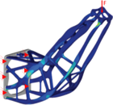

**2019**

- Patent application
- Successful trial at AIRBUS on a component made of Ti6Al4V

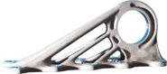

**2020-2022**

- Supply to ESA as standalone software
- Addition of surface defects tool
- ESA benchmark activity onto a component designed by PoliMi and printed
  by MTC

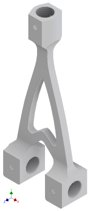

### History

After an initial concept in 2017, the software was developed in 2018 as
a Matlab(r) tool for postprocessing FE analyses, its concept was
patented and its results published.

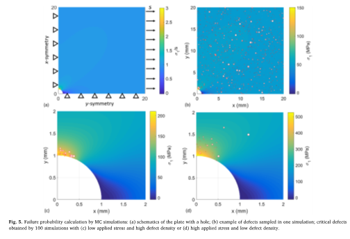

Software predictions were successfully compared to a series of
Montecarlo simulations.

------------------------------------------------------------------------

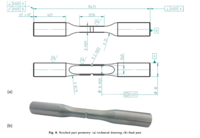

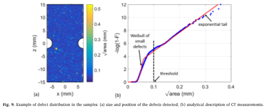

------------------------------------------------------------------------

After the Montecarlo simulations a series of tests on notched specimens,
that had been analyzed by X-ray tomography before the fatigue tests,
have been successfully compared with detailed crack growth analyses.

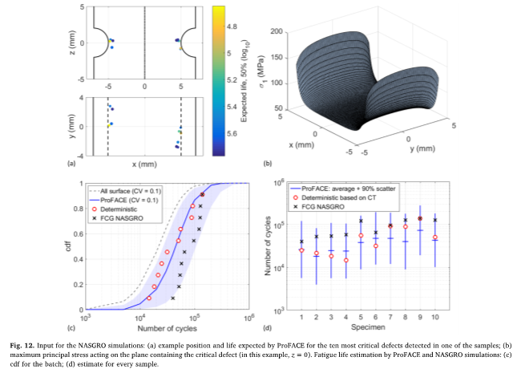

### From a model to a software

The initial version of the software was then tested in cooperation with
Airbus and it was then developed as a stand-alone compiled software, the
compiled version was then installed to ESA.

#### **From alfa version to ProFace1.0**

The initial concept was then extended, once we analized the results of
fatigue tests for a series of benchmark components (called wishbones)
that were manufactured by MTC and tested by the ESA (European Space
Agency) \[2\].

.png)

.png)

The analysis of results of machined and as-built components clarified
that a fracture-based fatigue assessment (the one implemented in
ProFACE) is the only one able to provide good life predictions, provided
that residual stresses were taken into account \[2\].

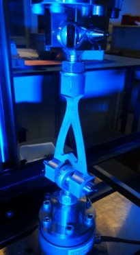

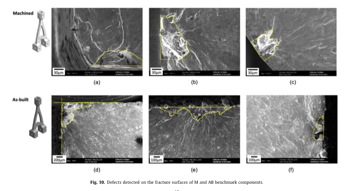

#### **Version 2.0**.

We further developed the tool to version 2.0 that allows the user to:

- describe material behaviour of different stress ratios through user
  input about the Haigh diagram and fatigue thresholds described by
  Nasgro equation;
- consider volumetric defects (that can randomly occur in any position
  in the material volume) and surface features related to net-shape
  surfaces;
- residual stresses on the external layers (characterized by the surface
  value and the local gradient) to fully represent the *local stress*
  state.

The results obtained by ProFACE 2.0 \[3\] allowed us to obtain very good
life predictions for specimens and “whishbones”.

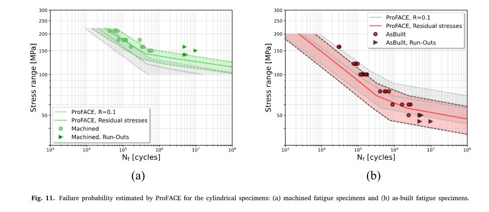

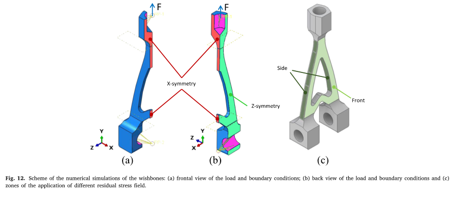

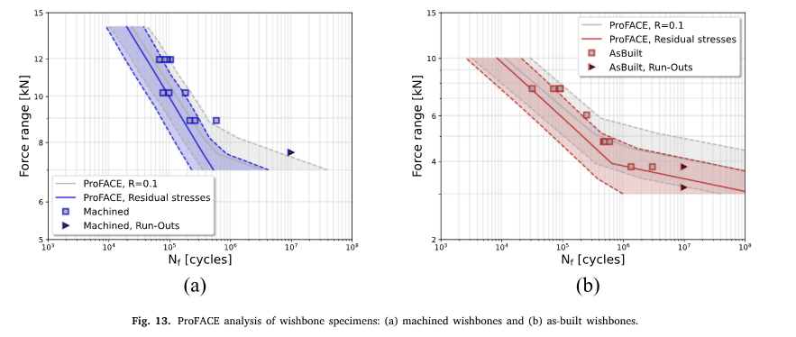

### Future developments

After the successfull benchmark on components manufactured by L-PBF in
AlSi10Mg, another ongoing research project (partners: MTC and PoliMI) is
devoted to testing components manufactured in Ti6Al4V.​

This activity will allow us:

- to establish a database of crack growth properties for annealed
  Ti6Al4V merging new data with PoliMi database;
- evaluate the effect of chemical milling;
- check the ProFACE predictions at different stress ratios.

Other developments of the software tool are planned in:

- SmartPROFACE project (a consortium led by PoliMI with partipants: MTC,
  BEAMIT, Thales France, Leonardo) where the outputs of defect
  acceptability maps will be adopted for the qualification of space
  components printed in Ti6Al4V and Scalmalloy;
- EU project NEUMANN, where ProFACE will be adopted for the assessment
  of aeroengine components in close cooperation with GE Avio (Rivalta,
  Italy)

#### References

\[1\] Romano, S., Miccoli, S., & Beretta, S. (2019). A new FE
post-processor for probabilistic fatigue assessment in the presence of
defects and its application to AM parts. *International Journal of
Fatigue*, *125*, 324-341.

\[2\] Beretta, S., L. Patriarca, M. Gargourimotlagh, A. Hardaker, D.
Brackett, M. Salimian, J. Gumpinger, and T. Ghidini. “A benchmark
activity on the fatigue life assessment of AlSi10Mg components
manufactured by L-PBF.” *Materials & Design* 218 (2022): 110713.

\[3\] Benchmark of a probabilistic fatigue software based on machined
and as-built components manufactured in AlSi10Mg by L-PBF  – F Sausto, S
Romano, L Patriarca, S Miccoli, S Beretta – International Journal of
Fatigue, 2022
