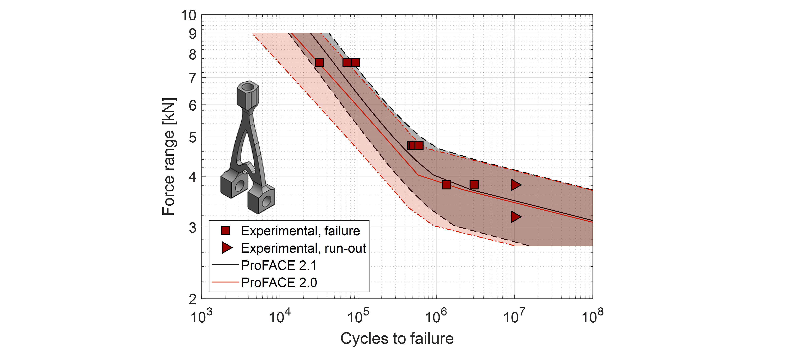

# ProFACE development

## Development timeline @ Politecnico di Milano \[PoliMi\]

------------------------------------------------------------------------
## History

After an initial concept in 2017, the software was developed in 2018 as a Matlab® tool for postprocessing FE analyses, its concept was patented and its results published.

*Failure probability calculation by MC simulations: (a) schematics of the plate with a hole; (b) example of defects sampled in one simulation; critical defects obtained by 100 simulations with (c) low applied stress and high defect density or (d) high applied stress and low defect density. \[1\]*

Software predictions were successfully compared to a series of Montecarlo simulations.

*Geometry of the notched specimens \[1\]*

*Example of defect distribution in the samples: (a) size and position of the defects detected; (b) analytical description of CT measurements. \[1\]*

After the Montecarlo simulations a series of tests on notched specimens, that had been analyzed by X-ray tomography before the fatigue tests, have been successfully compared with detailed crack growth analyses.

*Input for the NASGRO simulations: (a) example position and life expected by ProFACE for the ten most critical defects detected in one of the samples; (b) maximum principal stress acting on the plane containing the critical defect (in this example, z=0). Fatigue life estimation by ProFACE and NASGRO simulations: (c) cdf for the batch; (d) estimate for every sample. \[1\]*

### From model to software

The initial version of the software was then tested in cooperation with Airbus. The software was developed as a stand-alone compiled version, and then installed to ESA.

### From alfa version to ProFACE 1.0

The initial concept was extended, once we analized the results of fatigue tests for a series of benchmark components (called wishbones) that were manufactured by MTC and tested by the ESA (European Space Agency) \[2\].

*(a) Image of build layout and (b) photograph of one of the four identical manufactured builds. \[2\]*

The analysis of results of machined and as-built components clarified that a fracture-based fatigue assessment (the one implemented in ProFACE) is the only one able to provide good life predictions, provided that residual stresses were taken into account \[2\].

*Defects detected on the fracture surfaces of M and AB benchmark components. \[2\]*

------------------------------------------------------------------------
### Version 2.0

We further developed the tool to version 2.0 that allows the user to:

- describe material behaviour of different stress ratios through user input about the Haigh diagram and fatigue thresholds described by NASGRO equation;
- consider volumetric defects (that can randomly occur in any position in the material volume) and surface features related to net-shape surfaces;
- residual stresses on the external layers (characterized by the surface value and the local gradient) to fully represent the *local stress* state.

The results obtained by ProFACE 2.0 \[3\] allowed us to obtain very good life predictions for specimens and “wishbones”.

*Failure probability estimated by ProFACE for the cylindrical specimens: (a) machined fatigue specimens and (b) as-built fatigue specimens. \[3\]*

*Scheme of the numerical simulations of the wishbones: (a) frontal view of the load and boundary conditions; (b) back view of the load and boundary conditions and (c) zones of the application of different residual stress field. \[3\]*

*ProFACE analysis of wishbone specimens: (a) machined wishbones and (b) as-built wishbones. \[3\]*
------------------------------------------------------------------------
### Version 2.1

The current version 2.1 introduces an additional type of material strength model. The new model allows to simulate fatigue behaviour in presence of defects by means of the NASGRO equation for crack propagation.

This new implementation further improves the fatigue life predictions on the benchmark “wishbones”, with a reduced scatter in the finite life region.

*ProFACE 2.1 analysis of as-built wishbone specimens with the new material strength model*

------------------------------------------------------------------------
## Future developments

After the successfull benchmark on components manufactured by PBF-LB in AlSi10Mg, another ongoing research project (partners: MTC and PoliMI) is devoted to testing components manufactured in Ti6Al4V.

This activity will allow us:

- to establish a database of crack growth properties for annealed
  Ti6Al4V merging new data with PoliMi database;
- evaluate the effect of chemical milling;
- check the ProFACE predictions at different stress ratios.

Other developments of the software tool are planned in:

- SmartPROFACE project (a consortium led by PoliMI with partipants: MTC, BEAMIT, Thales France, Leonardo) where the outputs of defect acceptability maps will be adopted for the qualification of space components printed in Ti6Al4V and Scalmalloy®;
- EU project NEUMANN, where ProFACE will be adopted for the assessment of aeroengine components in close cooperation with GE Avio (Rivalta, Italy)
  
------------------------------------------------------------------------
## References

\[1\] Romano S., Miccoli S., and Beretta S. (2019). “A new FE post-processor for probabilistic fatigue assessment in the presence of defects and its application to AM parts” *International Journal of Fatigue* 125, 324-341

\[2\] Beretta S., Patriarca L., Gargourimotlagh M., Hardaker A., Brackett D., Salimian  M., Gumpinger J., and Ghidini. T. (2022) “A benchmark activity on the fatigue life assessment of AlSi10Mg components manufactured by L-PBF” *Materials & Design* 218, 110713

\[3\] Sausto F., Romano S., Patriarca L., Miccoli S., and Beretta S. (2022) “Benchmark of a probabilistic fatigue software based on machined and as-built components manufactured in AlSi10Mg by L-PBF” *International Journal of Fatigue* 165, 107171
