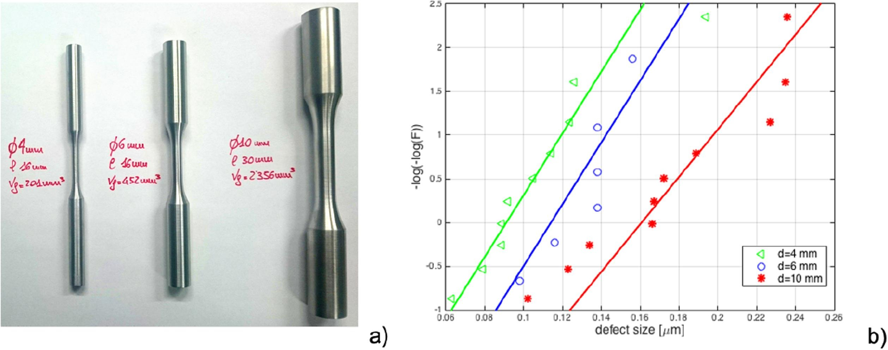
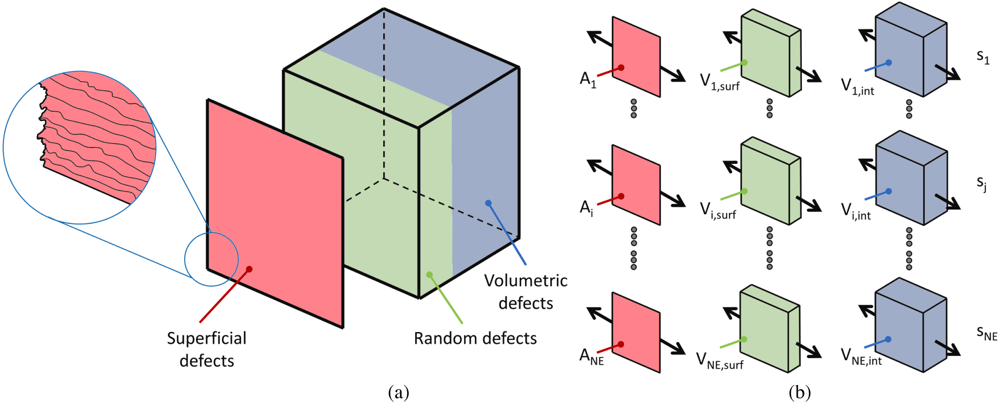
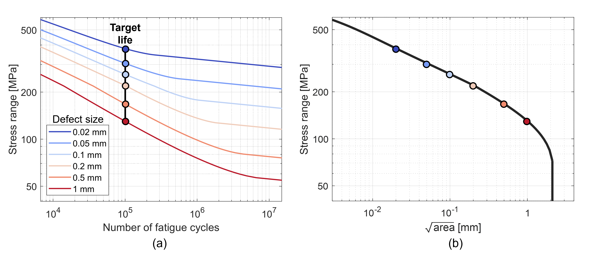
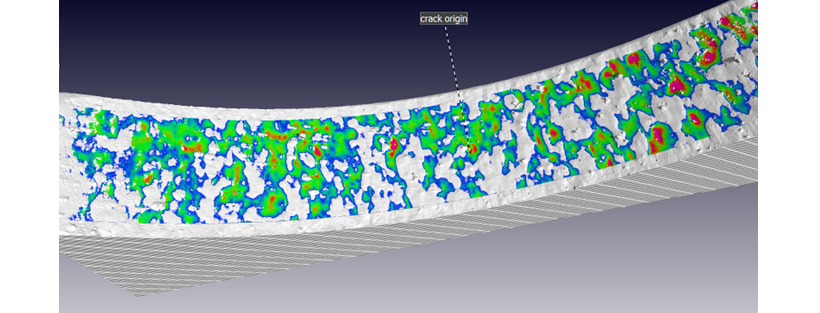
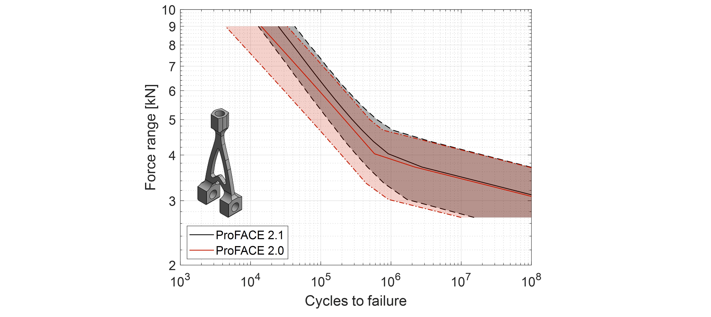
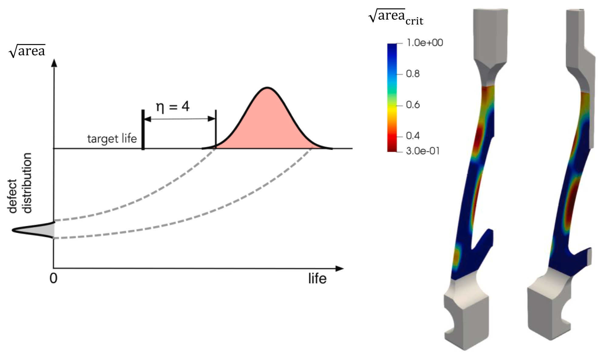

# Features

The basic concept of ProFACE software is to correctly consider the size effect, that is the theoretical prediction (confirmed by experiments \[1\]), that the distribution of largest defect increases with the material volume.

This effect can be modelled on a given material volume by:

- weakest link analysis;
- statistics of extremes.

ProFACE adopts the second approach, that is more robust and simple than the dirtiness curves needed by the weakest link approach.

*Evidence of the size effect for defects at the origin of fatigue failures in specimens manufactured by PBF-LB: a) specimens tested; b) probability paper of defects. \[1\]*

------------------------------------------------------------------------
The key point of ProFACE 2.0 for the probabilistic analysis is a patented component discretization in different parts, i.e. :

- surface elements, affected by surface features of net-shape AM surfaces;
- a surface volume where the volumetric defects can randomly be located close to the surface;
- internal volume where volumetric defects can randomly occur.

This discretizations allows the software to correctly calculate the failure probability of a component.

*Schematic of the analysis performed by ProFACE: a) distinction between volumetric and superficial analysis and b) weakest link applied to both volumes and surfaces. \[2\]*

------------------------------------------------------------------------
## Ingredients

The first **mechanical ingredient** of ProFACE 2.0 is a suitable description of fatigue in presence of defects through:

- Haigh diagram;
- NASGRO equation for thresholds;
- normalized S-N diagram.

These inputs allow the software to obtain a Kitagawa-Takahashi diagram, describing the relationship between limit stress and defect size, for different number of cycles and stress ratios.

*Schematic of the finite fatigue life model adopted in ProFACE for a general stress ratio R=-1: a) normalized S–N curve and b) generalized Kitagawa curves as a function of the number of cycles to failure. \[2\]*

A new approach, implemented in ProFACE 2.1, permits the description of the relationship between limit stress and defect size for target life and stress ratios by interpolating **defect size-dependent S-N curves**.

*a) S-N curves obtained from explicit fatigue crack growth calculations with NASGRO propagation equation. b) Relationship between limit stress and defect size for a target life of 100 000 cycles, derived from the S-N curves.*

------------------------------------------------------------------------

The two **probabilistic ingredients** are the main parameters that impact the scatter of fatigue strength:

1.  a description of the inherent fatigue resistance, defined as the scatter of the fatigue limit through a log-normal distribution;

2.  the distribution of material anomalies, divided in:

	– volumetric defects, described with ***extreme value statistics*** on data obtained with different experimental techniques (CT scan, anomalies at the origin of failures in witness specimens, etc.);

	– surface features, also described with ***extreme value statistics*** of features at the origin of failures or of roughness measurements of the net-shape surface.

    
------------------------------------------------------------------------
## Typical outputs

*Life estimates for a given component.*

*Maps for the critical defects' area.*
  
------------------------------------------------------------------------
## References

\[1\] Romano S., Patriarca L., Foletti S., and Beretta S. (2018) “LCF behaviour and a comprehensive life prediction model for AlSi10Mg obtained by SLM.” *International Journal of fatigue* 117, 47-62

\[2\] Sausto F., Romano S., Patriarca L., Miccoli S., and Beretta S. (2022) “Benchmark of a probabilistic fatigue software based on machined and as-built components manufactured in AlSi10Mg by L-PBF” *International Journal of Fatigue* 165, 107171