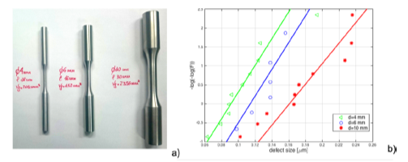
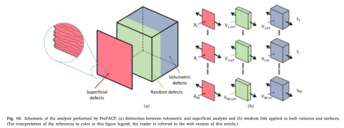
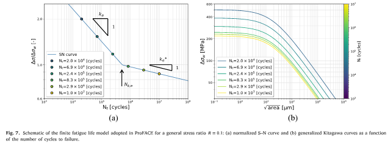
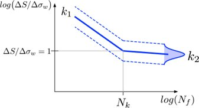
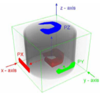
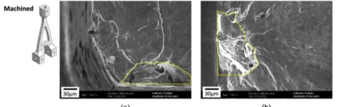
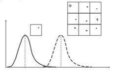
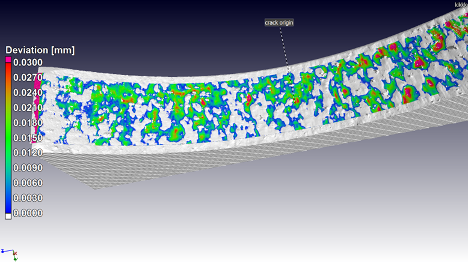

# Features

The basic concept of the ProFACE software, aimed at describing the
reliability of components with defects, is to correctly consider the
size ffect, that is the theoretical prediction (confirmed by experiments
\[4\]), that the distribution of largest defect increases with the
material volume.

This effect can be modelled (for a given material volume) by:

- weakest link analysis;
- statistics of extremes.

ProFACE adoptes the second approach, that is more robust and simple than
the dirtiness curves needed by the weakest-link approach.

Evidence of the size effect for defects at the orgin of fatigue failures
in specimens manufactured by L-PBF: a) specimens tested; b) probability
paper of defects \[4\]

------------------------------------------------------------------------

The key point of ProFACE 2.0 for the probabilistic analysis is a
patented component discretization in different parts:

- surface elements, affected by surface features of net-shape AM
  surfaces;
- a surface volume where the volumetric defects can randomly be located
  close to the surface;
- internal volume where volumetric defects can randomly occur.

This discretizations allows the software to correctly calculate the
failure probability of a component, where the volumetric defects can
randomly occur close to the surface or within the component volume.

#### Ingredients

The first **mechanical ingredient** of ProFACE 2.0 is suitable
description of fatigue in presence of defects through:

- Kitagawa diagram (fatigue limit as a funtion of defect size) as a
  function of stress ratio defined by the user with the haigh diagram
  and the Nasgro equation for thresholds;
- a normalized S-N diagram defined by the user.
- 

The two  inputs allows the software to obtain a Kitagawa diagram for
differen number of cycles and stress ratios.

------------------------------------------------------------------------

The probabilistic ingredients are the two main parameters that determine
the scatter of fatigue strength:

1.  a description of the inherent fatigue resistance by a scatter of the
    fatigue limit through a log-normal distribution (the scatter of
    fatigue strength is related also to life dispersion);

2.  the distribution of material anomalies divided in:

– volumetric defects, obtained through a suitable ***extreme value
statistics*** of data obtained with different experimental techniques
(CT scan, anomalies at the origin of failures in witness specimens);

– surface features, obtained by measuring the features at the origin of
failures or accurately measuring the roughness of the net-shape surface
(once again concepts of extreme value statistics have to be adopted for
describing the size effect for the surface features).

