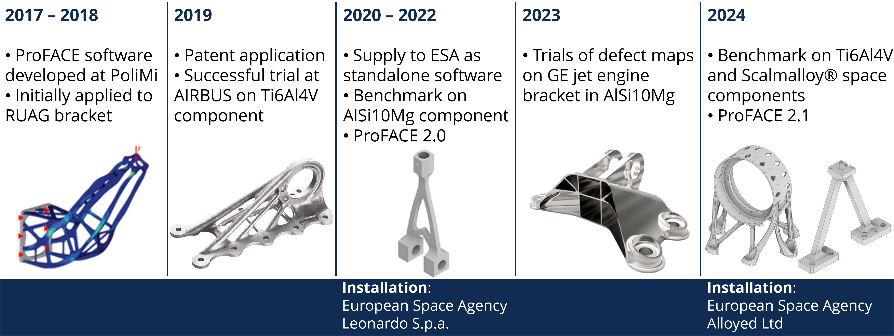

# ProFACE

The software for probabilistic fatigue assessment of components with defects, conceived as a tool for rapid fatigue analysis of additively manufactured parts.

*ProFACE workflow.*

## Keypoints

- It performs a **probabilistic fatigue assessment** of parts with **complex geometries** by evaluating the **effect** of volumetric defects and **surface** features on expected life.
- post-processing of ABAQUS® and MSC™ finite element analyses.
- Suitable for **Additive Manufacturing** and any **other** conventional manufacturing **process**.
- Current material database:
  - AlSi10Mg;
  - 17-4 PH;
  - Ti6Al4V.
- Developed and patented by **Politecnico di Milano**.

## Development timeline @ Politecnico di Milano \[PoliMi\]

