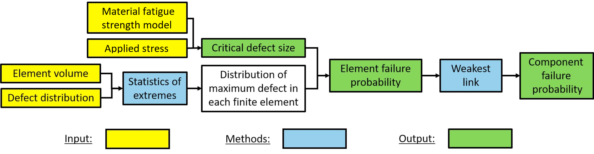
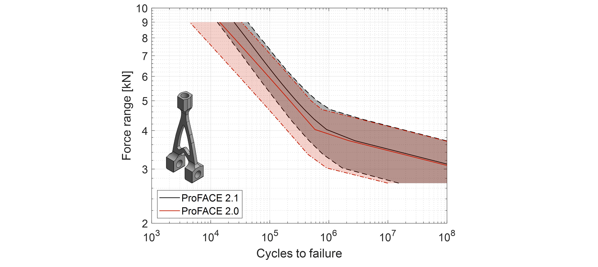
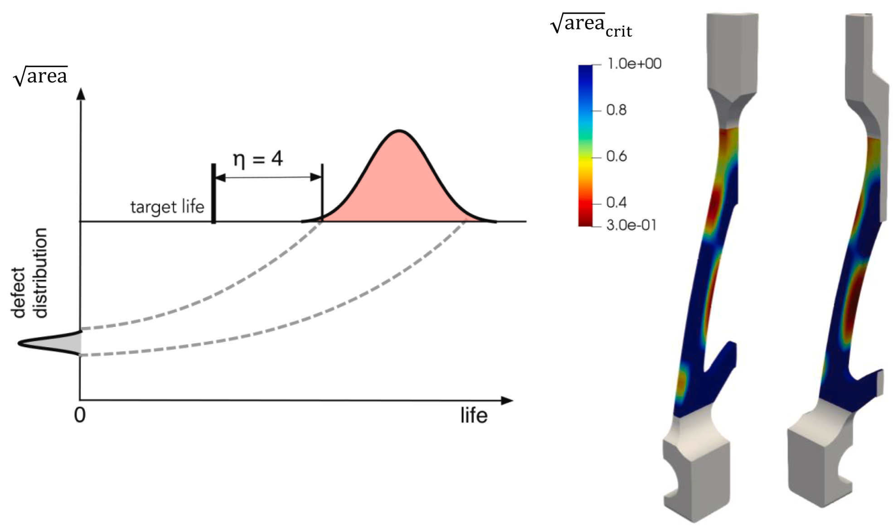

# ProFACE

The new software for the probabilistic fatigue assessment of components with defects, conceived as a tool for a quick assessment and fatigue analysis of additively manufactured components.

*ProFACE workflow*

## Keypoints

- It performs a **probabilistic fatigue assessment** of parts with **complex geometries** by evaluating the **effect** of volumetric defects and **surface** features on expected life
- post-processing of ABAQUS® and MSC™ finite element analyses
- Suitable for **Additive Manufacturing** and any **other** conventional manufacturing **processes**
- Current material database:
  - AlSi10Mg
  - 17-4 PH
  - Ti6Al4V
- Developed and patented by **Politecnico di Milano**

## Typical outputs

*Life estimation for a given component*

*Maps for the critical defects area*
