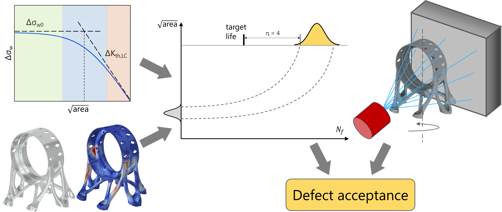

# Smart-ProFACE

Smart-ProFACE is the latest concept under development since 2022. The new software will be capable of generating ***defect acceptance maps*** representing the **maximum defect size** that can be accepted in a component.
 

*The Smart-ProFACE approach towards defect acceptance.*

Smart-ProFACE will be a finite element post-processor with the ability to interpret *non-destructive evaluation (NDE)* data to perform life assessments.
NDE-based assessments allow the evaluation of process-escape anomalies, defects generated by sub-optimal manufacturing conditions and that can represent harmful elements within a prospective target fatigue life. This analysis can follow a *deterministic* or a *fully-probabilistic* path, in relation to the scatter of fatigue and NDE data being considered in the assessment \[1\].

------------------------------------------------------------------------
## Project

Smart-ProFACE software is under development within the European Space Agency (ESA) tender *“Smart, reliable and cost-effective manufacturing and fatigue verification of mission critical structural items”*, in which Politecnico di Milano leads a consortium of European companies and research institutions, comprising The Manufacturing Technology Centre (The MTC, UK), BEAMIT S.p.a. (IT), Leonardo S.p.a. (IT) and Thales Alenia Space (FR).

The project involves the manufacturing of two space components by Powder Bed Fusion – Laser Beam (PBF-LB):

- an Isostatic Mounting Device in Ti6Al4V, designed by Leonardo and manufactured by The MTC;
- an Antenna Deployment and Pointing Mechanism bracket in Scalmalloy®, designed by Thales Alenia Space and manufactured by BEAMIT.

*Outlook of components that will be assessed with Smart-ProFACE.*

The components will be inspected by X-ray computed tomography and the acceptance of the detected anomalies for each target life will be assessed with Smart-ProFACE software.
  
------------------------------------------------------------------------
## References

\[1\] Rusnati L., Yosifov M., Senck S., Hubmann R., and Beretta S. (2024) “Anomaly detection by X-ray tomography and probabilistic fatigue assessment of aluminum brackets manufactured by PBF-LB.” *Materials & Design* 248, 113467
